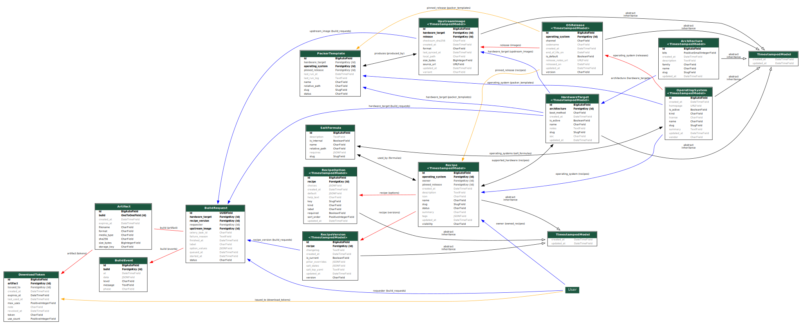

# Data model

Each app owns its own slice of the schema. Relationships drawn left-to-right:

```
Architecture ──◀── HardwareTarget ──◀── UpstreamImage ──▶── OSRelease ──▶── OperatingSystem
                                                                              │
                                                                              ▼
                                                                            Recipe ──▶── RecipeVersion
                                                                              │              │
                                                                              ▼              ▼
                                                                       RecipeOption     BuildRequest ──▶── Artifact ──▶── DownloadToken
                                                                                                          │
                                                                                                          └──◀── BuildEvent
```

## Generated ORM diagram

The full field-level diagram is generated from the live models with
[`django-extensions`](https://django-extensions.readthedocs.io/en/latest/graph_models.html)
and committed under `docs/`. Regenerate after any model change:

```bash
make orm-diagram
```



Also available: [`orm.png`](orm.png) (raster), [`orm.dot`](orm.dot) (Graphviz source).

## `catalog`

### `Architecture`

| Field         | Notes                                                    |
| ------------- | -------------------------------------------------------- |
| `slug`        | Unique, e.g. `arm64`, `armv7l`, `amd64`, `i686`.         |
| `name`        | Display name, e.g. *ARM 64-bit (aarch64)*.               |
| `family`      | One of `arm`, `x86`, `riscv`, `other`.                   |
| `bits`        | Word size (default 64).                                  |
| `description` | Free text.                                               |

### `HardwareTarget`

A specific board / SoC profile. Binds an `Architecture` with a boot expectation.

| Field          | Notes                                                            |
| -------------- | ---------------------------------------------------------------- |
| `slug`         | Unique, e.g. `rpi5`, `rpi-zero2w`, `pc-x86_64-uefi`.              |
| `name`         | Human label.                                                     |
| `architecture` | FK → `Architecture`.                                             |
| `boot_method`  | `rpi`, `uboot`, `uefi`, `bios`, `custom`.                        |
| `soc`          | Optional SoC string (e.g. `BCM2712`).                            |
| `notes`        | Free text.                                                       |
| `is_active`    | Hide retired targets without deleting them.                      |

### `OperatingSystem`

| Field      | Notes                                                |
| ---------- | ---------------------------------------------------- |
| `slug`     | Unique, e.g. `batocera`, `raspios`, `ubuntu`.        |
| `name`     | Display name.                                        |
| `vendor`   | Optional vendor.                                     |
| `kind`     | `retro`, `desktop`, `server`, `embedded`, `iot`.     |
| `homepage` | URL.                                                 |
| `license`  | Free-text license tag.                               |
| `summary`  | Free text.                                           |

### `OSRelease`

| Field             | Notes                                                            |
| ----------------- | ---------------------------------------------------------------- |
| `operating_system`| FK → `OperatingSystem`.                                          |
| `version`         | e.g. `41`, `24.04.1`, `2025-05-13`.                              |
| `codename`        | e.g. `Bookworm`, `Noble`.                                        |
| `channel`         | `stable`, `lts`, `beta`, `dev`, `nightly`.                       |
| `released_on`     | Optional date.                                                   |
| `end_of_life_on`  | Optional date.                                                   |
| `is_default`      | If true, recipes without `pinned_release` resolve to this one.   |

Uniqueness: `(operating_system, version, channel)`.

### `UpstreamImage`

The OS vendor's published image for one hardware target. Packer refreshes this.

| Field             | Notes                                                            |
| ----------------- | ---------------------------------------------------------------- |
| `release`         | FK → `OSRelease`.                                                |
| `hardware_target` | FK → `HardwareTarget`.                                           |
| `variant`         | Vendor variant, e.g. `lite`, `desktop-full`.                     |
| `format`          | `img.xz`, `img.gz`, `img.zip`, `img`, `iso`, `qcow2`.            |
| `source_url`      | Upstream HTTPS URL.                                              |
| `checksum_sha256` | Hex digest of the local mirror.                                  |
| `size_bytes`      | Local mirror size.                                               |
| `local_path`      | On-disk path used by the orchestrator.                           |
| `last_synced_at`  | When Packer last refreshed.                                      |

Uniqueness: `(release, hardware_target, variant)`.

## `recipes`

### `Recipe`

| Field                 | Notes                                                    |
| --------------------- | -------------------------------------------------------- |
| `slug`                | Unique.                                                  |
| `name`                | Display name.                                            |
| `summary` / `description` | Short + long form text (Markdown).                   |
| `operating_system`    | FK → `OperatingSystem`.                                  |
| `pinned_release`      | Optional FK → `OSRelease`. If null, uses OS default.     |
| `supported_hardware`  | M2M → `HardwareTarget`.                                  |
| `visibility`          | `private`, `internal`, `public`.                         |
| `status`              | `draft`, `active`, `deprecated`.                         |
| `owner`               | FK → User.                                               |
| `tags`                | JSON list of free-text tags.                             |

### `RecipeVersion`

Immutable snapshot of the recipe's Salt configuration.

| Field             | Notes                                                                       |
| ----------------- | --------------------------------------------------------------------------- |
| `recipe`          | FK → `Recipe`.                                                              |
| `version`         | Semver-ish (e.g. `1.4.0`).                                                  |
| `is_current`      | Marks the version that new builds default to. Only one per recipe.          |
| `salt_top_yaml`   | Optional inline `top.sls` fragment.                                         |
| `salt_states`     | JSON list of state IDs to apply, e.g. `["base.hardening", "batocera.arcade"]`. |
| `pillar_overrides`| JSON tree merged on top of OS defaults at build time.                       |
| `changelog`       | Free text.                                                                  |

`save()` keeps the `is_current` invariant: setting it on a new version unsets it on all others for the same recipe.

### `RecipeOption`

A build-time form field exposed to the user.

| Field         | Notes                                                                  |
| ------------- | ---------------------------------------------------------------------- |
| `recipe`      | FK → `Recipe`.                                                         |
| `key`         | Pillar key — becomes `pillar['options'][key]`.                         |
| `label`       | UI label.                                                              |
| `help_text`   | UI tooltip.                                                            |
| `kind`        | `string`, `text`, `integer`, `boolean`, `choice`, `multi_choice`, `file`, `ssh_key`, `secret`. |
| `default`     | JSON default value.                                                    |
| `choices`     | For `choice` / `multi_choice`: list of `{value, label}` dicts.         |
| `required`    | Bool.                                                                  |
| `sort_order`  | Render order.                                                          |

Uniqueness: `(recipe, key)`.

## `builds`

### `BuildRequest`

UUID-keyed because tokens / URLs link to it. Tracks the lifecycle.

| Field             | Notes                                                                  |
| ----------------- | ---------------------------------------------------------------------- |
| `id`              | UUID4.                                                                 |
| `requester`       | FK → User (nullable for anonymous API builds).                          |
| `recipe_version`  | FK → `RecipeVersion`.                                                  |
| `hardware_target` | FK → `HardwareTarget`.                                                 |
| `upstream_image`  | FK → `UpstreamImage` (resolved at submit).                             |
| `option_values`   | JSON: filled-in RecipeOptions.                                         |
| `label`           | Optional free-text label.                                              |
| `status`          | `queued`, `preparing`, `building`, `finalizing`, `succeeded`, `failed`, `cancelled`, `expired`. |
| `queued_at` / `started_at` / `finished_at` | Timeline timestamps.                              |
| `failure_reason`  | Set on failure.                                                        |
| `celery_task_id`  | The dispatched Celery task ID.                                         |

### `BuildEvent`

Append-only timeline of phases (`prepare`, `pillar`, `mount`, `salt`, `pack`, `publish`, `error`, `done`) with optional structured `data`.

### `Artifact`

| Field         | Notes                                                                  |
| ------------- | ---------------------------------------------------------------------- |
| `build`       | One-to-one → `BuildRequest`.                                           |
| `storage_key` | Path within the artifacts storage backend.                             |
| `filename`    | Filename presented to the downloader.                                  |
| `format`      | `img.xz`, `img.gz`, `img.zip`, `img`, `iso`.                           |
| `size_bytes`  | Bytes.                                                                 |
| `sha256`      | Hex digest.                                                            |
| `media_type`  | MIME type.                                                             |
| `expires_at`  | Optional retention deadline (artifact is purged after).                |

### `DownloadToken`

| Field         | Notes                                                                  |
| ------------- | ---------------------------------------------------------------------- |
| `artifact`    | FK → `Artifact`.                                                       |
| `token`       | URL-safe, 32-byte random string. Unique.                               |
| `issued_to`   | FK → User (nullable).                                                  |
| `expires_at`  | TTL deadline.                                                          |
| `max_uses`    | 0 = unlimited within TTL.                                              |
| `use_count`   | Incremented on every successful download.                              |
| `revoked_at`  | Set to revoke without deletion.                                        |

`is_valid` returns False if revoked, expired, or over-used.

## `infra`

### `PackerTemplate`

Pointer to an `.pkr.hcl` file under `PACKER_TEMPLATES_ROOT`. Tracks `last_run_at` and what `UpstreamImage` rows the template refreshes.

### `SaltFormula`

Pointer to a directory under `SALT_STATES_ROOT/` that contains an `init.sls`. Cross-linked with the recipes that consume it.

The `manage.py sync_filesystem` command reconciles both registries with the directory tree on disk.
